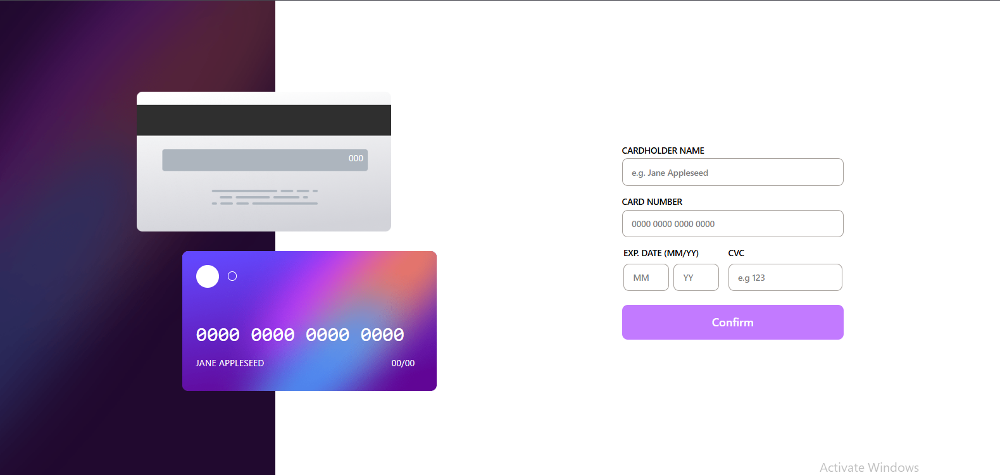

# 💳 Interactive Card Input Form (React)

This is a responsive and interactive credit card form built with **React** and **TailwindCSS**. 
Users can enter their card details — including **name**, **card number**, **expiration month/year**, and **CVC** — which are instantly displayed on a live preview of the front and back of the card.

It includes **form validation** to ensure correct input formatting, with clear error messages shown when incorrect or incomplete details are entered.

---

## ✨ Features

- 🔄 Real-time card detail updates on a styled card UI (front and back)
- 🧠 Smart form validation:
  - Name must contain only letters
  - Card number must be 16 digits
  - Month must be between 01–12
  - Year must be 2 digits
  - CVC must be 3 digits
- 🎨 Responsive layout for both desktop and mobile views
- ❌ Displays inline error messages for invalid inputs
- ✅ "Successful" confirmation screen on successful form submission

---

## 🖼️ Screenshots

### 🖥️ Live View
> 


---

## 🚀 Getting Started

### 1. Clone the repo

```bash
git clone https://github.com/your-username/interactive-card-react.git
cd interactive-card-react
```

2. Install dependencies
```bash
npm install
```

3. Start the development server
```bash
npm run dev
``` 
## 📁 Project Structure
```arduino
interactive-card-react/
├── public/
│   ├── bg-card-front.png
│   ├── bg-card-back.png
│   └── ...
├── src/
│   ├── App.jsx
│   ├── main.jsx
│   └── ...
├── package.json
└── README.md
```
## 🔍Validation Rules

| Field       | Validation                       |
| ----------- | -------------------------------- |
| Name        | Letters and spaces only          |
| Card Number | 16 digits (auto formatted in 4s) |
| Month       | Must be between 01 and 12        |
| Year        | Must be 2 digits (e.g. `25`)     |
| CVC         | Must be 3 digits                 |


### 📦 Deployment

https://interactive-card-two-black.vercel.app/